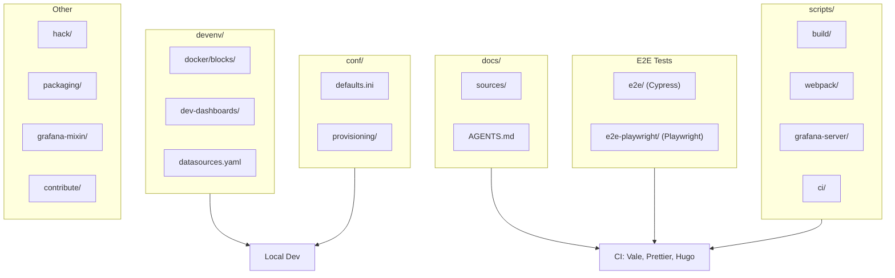
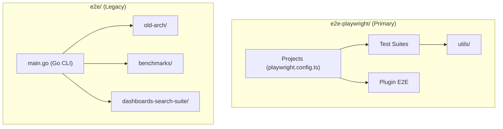
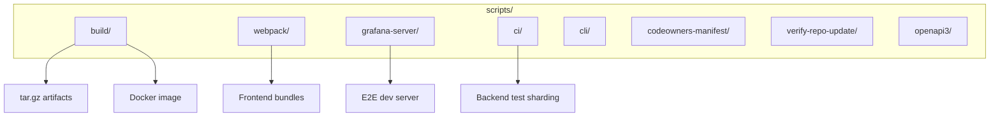
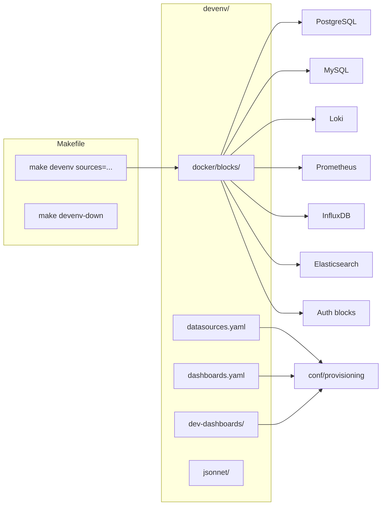
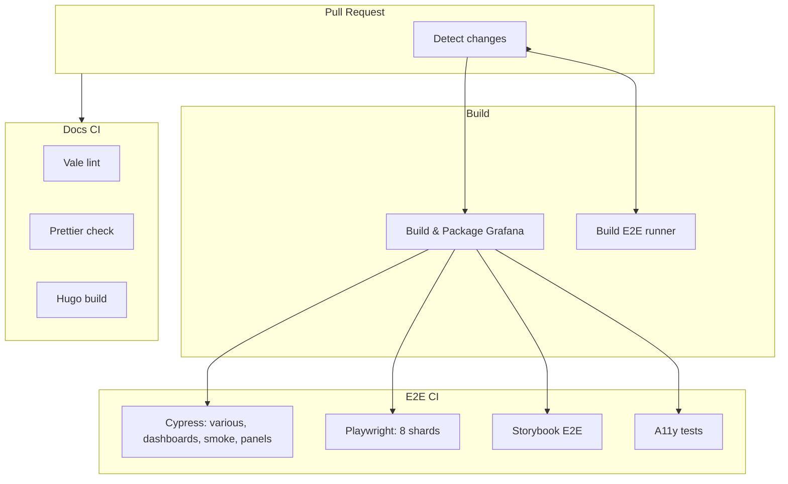

# Architecture: Docs, Tests, and Tooling

This document describes the architecture of the **Docs, Tests, and Tooling** chunk of the Grafana repository: documentation, end-to-end tests, build and utility scripts, development environment configuration, and related tooling.

---

## Overview



---

## Directory Layout

| Directory | Purpose |
|-----------|---------|
| `docs/` | Technical documentation sources (Hugo-based) |
| `e2e/` | Legacy Cypress E2E tests and Go test runner |
| `e2e-playwright/` | Playwright E2E tests (primary framework) |
| `scripts/` | Build, webpack, CI, and utility scripts |
| `devenv/` | Development environment (Docker blocks, provisioning) |
| `conf/` | Server configuration and provisioning samples |
| `hack/` | Kubernetes-style codegen (OpenAPI, client generation) |
| `packaging/` | RPM, DEB, Docker packaging definitions |
| `grafana-mixin/` | Prometheus alerts and dashboards for Grafana self-monitoring |
| `contribute/` | Contributor guides, style guides, developer docs |

---

## Documentation (`docs/`)

### Structure

Documentation is organized under `docs/sources/` with a hierarchical structure. Content is built with [Hugo](https://gohugo.io/) and published to grafana.com/docs.

```mermaid
flowchart LR
    subgraph sources["docs/sources/"]
        intro["introduction/"]
        setup["setup-grafana/"]
        datasources["datasources/"]
        visualizations["visualizations/"]
        alerting["alerting/"]
        administration["administration/"]
        developer["developer-resources/"]
        ascode["as-code/"]
        upgrade["upgrade-guide/"]
        whatsnew["whatsnew/"]
        fundamentals["fundamentals/"]
        troubleshooting["troubleshooting/"]
        breaking["breaking-changes/"]
    end

    sources --> hugo[Hugo Build]
    hugo --> prod[Production Docs]
```



### Key areas

- **`introduction/`** — Getting started, overview
- **`setup-grafana/`** — Installation, configuration, authentication
- **`datasources/`** — Per-datasource docs (Prometheus, MySQL, Tempo, etc.)
- **`visualizations/`** — Dashboards, panels, Explore
- **`alerting/`** — Alert rules, contact points, provisioning
- **`administration/`** — User management, plugins, licensing
- **`developer-resources/`** — HTTP API reference, SDK
- **`as-code/`** — Terraform, Ansible, Git sync
- **`upgrade-guide/`** — Version upgrade guides
- **`whatsnew/`** — Release notes

### Doc conventions

- **Style guide**: `docs/AGENTS.md` — voice, tense, wordlist, formatting
- **Writers' Toolkit**: [grafana/writers-toolkit](https://github.com/grafana/writers-toolkit) for contribution guidelines
- **Front matter**: YAML between `---`; `title` must match h1
- **Shortcodes**: Hugo shortcodes (e.g. ``) for notes/warnings

---

## End-to-End Tests

Grafana uses two E2E frameworks: a legacy **Cypress** setup in `e2e/` and the primary **Playwright** setup in `e2e-playwright/`.

### Test structure



### Playwright projects (`e2e-playwright/`)

| Project | Directory | Purpose |
|---------|-----------|---------|
| `authenticate` | `@grafana/plugin-e2e/auth` | Login, store session |
| `admin` | `plugin-e2e/plugin-e2e-api-tests/as-admin-user` | Admin API tests |
| `viewer` | `plugin-e2e/plugin-e2e-api-tests/as-viewer-user` | Viewer RBAC tests |
| `various` | `various-suite/` | General UI tests |
| `panels` | `panels-suite/` | Panel visualizations |
| `dashboards` | `dashboards-suite/` | Dashboard features |
| `smoke` | `smoke-tests-suite/` | Smoke tests |
| `alerting` | `alerting-suite/` | Alerting flows |
| `dashboard-cujs` | `dashboard-cujs/` | Critical user journeys |
| `plugin-e2e/*` | `plugin-e2e/<datasource>/` | Datasource-specific (MySQL, MSSQL, etc.) |
| `test-plugins/*` | `test-plugins/` | Test plugin E2E |

### Cypress suites (`e2e/`)

- **`old-arch/`** — Dashboards, panels, smoke, various (with `dashboardScene=false`)
- **`dashboards-search-suite/`** — Dashboard search (Kubernetes dashboards)
- **`benchmarks/`** — Live panel benchmarks

### Framework patterns

- **Selector**: `data-testid` attributes, defined in `@grafana/e2e-selectors`
- **Page**: Abstraction with `visit` and selectors
- **Component**: Selectors without `visit`
- **Flow**: Reusable action sequences across pages

---

## Scripts (`scripts/`)

### Layout



### Key scripts

| Script | Purpose |
|--------|---------|
| `grafana-server/start-server` | Start Grafana for E2E (port 3001, devenv provisioning) |
| `grafana-server/wait-for-grafana` | Wait for server readiness |
| `grafana-server/variables` | `RUNDIR`, `PORT`, `PROV_DIR`, etc. |
| `build/build.sh` | Full build (backend, frontend, packages) |
| `build/update_repo/*` | DEB/RPM repo publishing |
| `ci/backend-tests/shard.sh` | Shard Go tests for CI |
| `docs/generate-transformations.ts` | Generate Transform Data doc from code |
| `codeowners-manifest/*` | CODEOWNERS manifest generation |
| `webpack/*` | Webpack configs (dev, prod, stats) |

---

## Development Environment (`devenv/`)

### Purpose

`devenv` provides Docker-based backing services (datasources, auth, etc.) and provisioning for local development and E2E tests.



### Usage

```bash
# Start optional services (e.g. Postgres, Loki, InfluxDB)
make devenv sources=postgres,loki,influxdb

# Stop services
make devenv-down

# Integration tests (start DBs first)
make devenv sources=postgres_tests,mysql_tests
make test-go-integration-postgres
make test-go-integration-mysql
```

### Provisioning

- **`datasources.yaml`** — Defines gdev-* datasources (Prometheus, Loki, MySQL, etc.)
- **`dashboards.yaml`** — Points to `dev-dashboards/`
- **`alert_rules.yaml`** — Alert provisioning
- **`plugins.yaml`** — Plugin provisioning

The E2E start-server script copies these into `$RUNDIR/conf/provisioning/` and uses them for the test run.

---

## Configuration (`conf/`)

| File | Purpose |
|------|---------|
| `defaults.ini` | Default server config (paths, server, security, etc.) |
| `sample.ini` | Example overrides |
| `provisioning/` | Sample provisioning (datasources, dashboards, plugins, alerting) |
| `ldap.toml` | LDAP config samples |

`defaults.ini` sets `permitted_provisioning_paths` to include `devenv/dev-dashboards` and `conf/provisioning`.

---

## Hack, Packaging, Grafana Mixin, Contribute

### `hack/`

Kubernetes-style codegen for OpenAPI and client generation:

- **`update-codegen.sh`** — Regenerate OpenAPI Go code
- **`openapi-codegen.sh`** — OpenAPI codegen
- **`externalTools.go`** — Codegen tool references

### `packaging/`

- **`deb/`** — Debian package (control, systemd, init.d)
- **`rpm/`** — RPM package (control, systemd, sysconfig)
- **`docker/`** — Dockerfile, build scripts, run.sh
- **`autocomplete/`** — Bash, zsh, PowerShell completions
- **`wrappers/`** — grafana, grafana-server, grafana-cli wrappers

### `grafana-mixin/`

Prometheus alerts and dashboards for Grafana self-monitoring:

- **`mixin.libsonnet`** — Main mixin
- **`alerts/alerts.libsonnet`** — Alert rules
- **`rules/rules.libsonnet`** — Recording rules
- **`dashboards/`** — Dashboard JSON
- **`scripts/`** — build, lint, format (mixtool, jsonnetfmt)

```bash
make build   # Produces alerts.yaml, rules.yaml, dashboard_out/
```

### `contribute/`

Contributor documentation:

- **`developer-guide.md`** — Build, test, devenv setup
- **`documentation/README.md`** — Doc contribution (Writers' Toolkit)
- **`style-guides/`** — e2e-playwright, frontend, redux, themes, etc.
- **`backend/`** — Backend style, services, instrumentation
- **`architecture/`** — Backend/frontend architecture notes

---

## How to Run Tests

### Playwright (primary)

```bash
# Install browsers
yarn playwright install chromium

# Run all Playwright tests (starts server on 3001, provisions devenv)
yarn e2e:playwright

# Run against existing Grafana
GRAFANA_URL=http://localhost:3000 yarn e2e:playwright

# Run specific project
yarn e2e:playwright --project dashboards

# Run by test name
yarn e2e:playwright --grep "dashboard templating"

# Open UI
yarn e2e:playwright --ui

# View last report
yarn playwright show-report
```

### Cypress (legacy)

```bash
# Old-arch suites (dashboards, panels, smoke, various)
yarn e2e:old-arch

# Dashboard search
yarn e2e:dashboards-search

# Debug mode
yarn e2e:debug

# Dev mode (Cypress UI)
yarn e2e:dev
```

### Unit tests

```bash
# Frontend (Jest)
yarn test
yarn test:ci

# Backend (Go)
go test ./pkg/...
make test-go-unit

# Integration (Postgres/MySQL)
make devenv sources=postgres_tests,mysql_tests
make test-go-integration-postgres
make test-go-integration-mysql
```

---

## CI and Build Flow



### Workflows

| Workflow | Triggers | Jobs |
|----------|----------|------|
| `pr-e2e-tests.yml` | PR, push to main | Build Grafana, Cypress suites, Playwright (8 shards), Storybook, A11y |
| `documentation-ci.yml` | PR with `docs/sources/**` | Vale (Grafana.GrafanaCom, WordList, Spelling, ProductPossessives) |
| `lint-build-docs.yml` | PR with `*.md`, `docs/**` | Prettier, Hugo build in `grafana/docs-base` |

---

## Summary of Diagrams

| Diagram | Type | Purpose |
|---------|------|---------|
| **Overview** | flowchart | High-level mapping of docs, e2e, scripts, devenv, conf, and other tooling |
| **Documentation structure** | flowchart | Flow from `docs/sources/` sections to Hugo build and production docs |
| **E2E test structure** | flowchart | Playwright vs Cypress layout and relationships |
| **Scripts layout** | flowchart | Script categories and outputs (build, webpack, grafana-server, ci) |
| **Devenv** | flowchart | Docker blocks, provisioning files, and Makefile commands |
| **CI and build flow** | flowchart | PR → change detection → build → E2E jobs and docs CI |

---

## References

- [Developer guide](../developer-guide.md)
- [E2E Playwright style guide](../style-guides/e2e-playwright.md)
- [Documentation contribution](../documentation/README.md)
- [Docs AGENTS.md](../../docs/AGENTS.md)
- [Writers' Toolkit](https://github.com/grafana/writers-toolkit)
