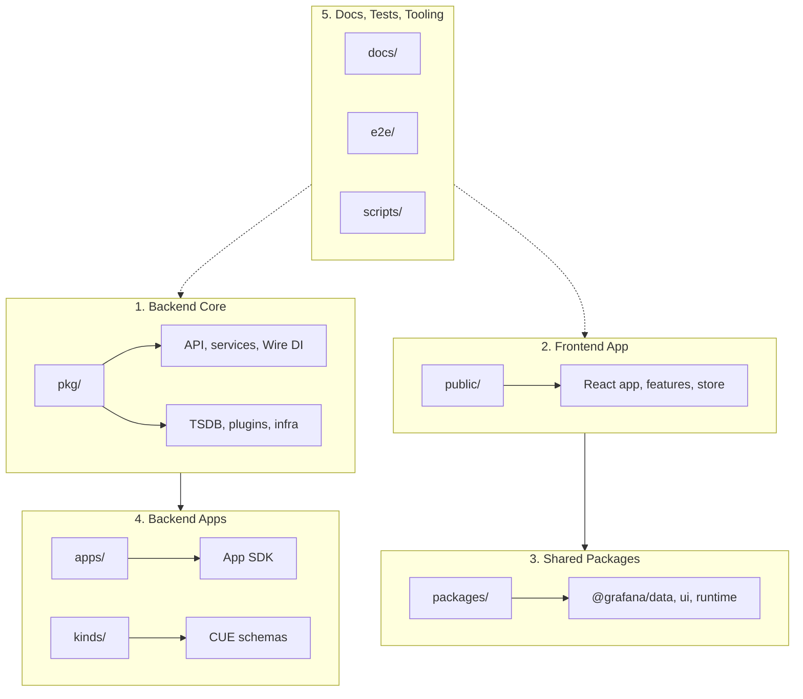

# Grafana Repository Architecture Overview

This document provides a high-level overview of the Grafana monorepo, organized into five logical chunks. Each chunk has dedicated architecture documentation with Mermaid diagrams.

---

## Five-Chunk Model

The repository is divided into five major areas by architecture and domain:

---

## Chunk Summaries

| Chunk | Paths | Size | Documentation |
|-------|-------|------|---------------|
| **1. Backend Core** | `pkg/` | ~66MB | [backend-core.md](backend-core.md) |
| **2. Frontend App** | `public/` | ~85MB | [public/ARCHITECTURE.md](../../public/ARCHITECTURE.md) |
| **3. Shared Packages** | `packages/` | ~20MB | [packages-architecture.md](packages-architecture.md) |
| **4. Backend Apps** | `apps/`, `kinds/`, `kindsv2/` | ~17MB | [backend-apps.md](backend-apps.md) |
| **5. Docs, Tests, Tooling** | `docs/`, `e2e/`, `scripts/`, etc. | ~10MB+ | [contribute/architecture/docs-tests-tooling.md](../../contribute/architecture/docs-tests-tooling.md) |

---

## 1. Backend Core (`pkg/`)

Go backend: API handlers, services, Wire DI, TSDB backends, plugin system, and infrastructure.

**Covers:** Directory layout, startup sequence, HTTP request flow, service layer, query execution, plugin system, configuration.

**Diagrams:** 11 Mermaid diagrams (flowcharts, sequence diagrams, class diagrams).

→ [Full documentation](backend-core.md)

---

## 2. Frontend App (`public/`)

React/TypeScript application: core services, features (dashboard, alerting, explore), Redux store, routing, and plugin architecture.

**Covers:** Component hierarchy, bootstrap flow, data flow, Redux structure, routing, feature architecture, shared patterns (Emotion, RTK Query, hooks).

**Diagrams:** 10 Mermaid diagrams (flowcharts, sequence diagrams).

→ [Full documentation](../../public/ARCHITECTURE.md)

---

## 3. Shared Packages (`packages/`)

Yarn workspace packages consumed by the frontend: `@grafana/data`, `@grafana/ui`, `@grafana/runtime`, `@grafana/schema`, and others.

**Covers:** Dependency graph, package relationships, CUE → schema flow, webpack resolution, build pipeline, consumption by `public/app`.

**Diagrams:** 6 Mermaid diagrams (dependency graph, data flow, build pipeline).

→ [Full documentation](packages-architecture.md)

---

## 4. Backend Apps (`apps/`, `kinds/`, `kindsv2/`)

Standalone Go apps using the Grafana App SDK, plus CUE schemas for dashboard/panel definitions.

**Covers:** App SDK architecture, app lifecycle, CUE schema flow, kind generation, integration with `pkg/`, Go workspace modules.

**Diagrams:** 6 Mermaid diagrams (flowcharts, sequence diagrams).

→ [Full documentation](backend-apps.md)

---

## 5. Docs, Tests, and Tooling

Documentation, E2E tests (Playwright/Cypress), scripts, devenv, configuration, and CI.

**Covers:** Doc structure, E2E test layout, scripts, devenv setup, CI and build flow.

**Diagrams:** 6 Mermaid diagrams (overview, doc structure, E2E layout, scripts, devenv, CI flow).

→ [Full documentation](../../contribute/architecture/docs-tests-tooling.md)

---

## Quick Reference

| Need to… | Go to |
|----------|-------|
| Understand backend services and Wire DI | [backend-core.md](backend-core.md) |
| Understand React app structure and features | [public/ARCHITECTURE.md](../../public/ARCHITECTURE.md) |
| Understand shared packages and dependencies | [packages-architecture.md](packages-architecture.md) |
| Understand App SDK and CUE schemas | [backend-apps.md](backend-apps.md) |
| Run tests, set up dev env, or contribute docs | [docs-tests-tooling.md](../../contribute/architecture/docs-tests-tooling.md) |

---

*This overview was compiled from architecture documentation produced by the senior-doc-writer subagent for each of the five repository chunks.*
