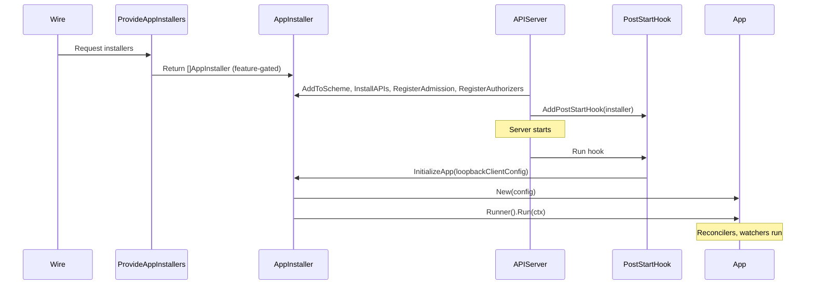
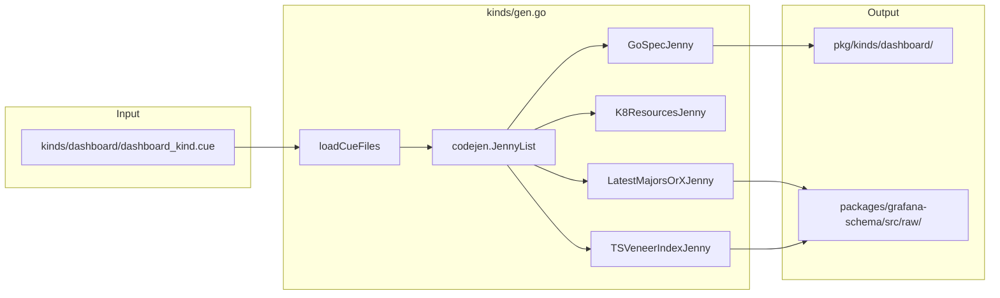
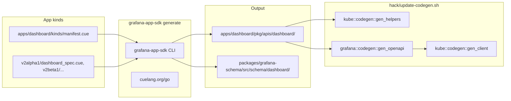
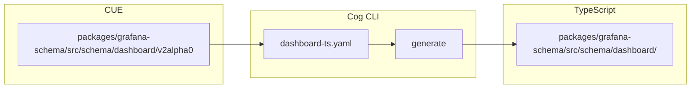
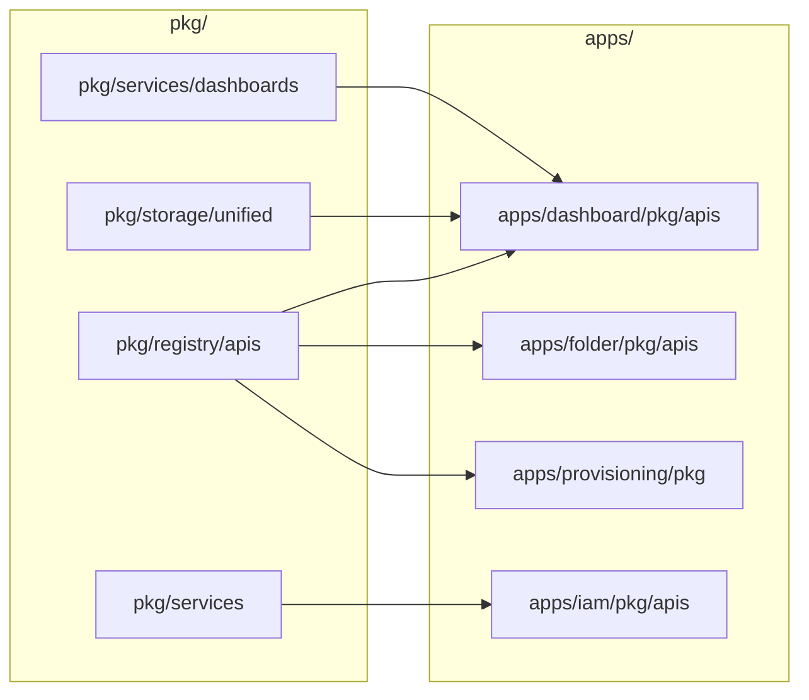

# Backend Apps Architecture

This document describes the architecture of the **Backend Apps** subsystem in the Grafana repository: standalone Go apps using the Grafana App SDK, CUE schemas for kinds, and the code generation pipelines that produce Go and TypeScript from those schemas.

---

## Table of Contents

1. [Overview](#overview)
2. [Directory Layout](#directory-layout)
3. [App SDK Architecture](#app-sdk-architecture)
4. [App Lifecycle](#app-lifecycle)
5. [CUE Schema Flow](#cue-schema-flow)
6. [Kind Generation](#kind-generation)
7. [Integration with pkg/](#integration-with-pkg)
8. [Go Workspace Modules](#go-workspace-modules)

---

## Overview

Backend Apps are standalone Go modules that extend Grafana's API server with Kubernetes-style resource APIs (CRUD, watch, etc.). Each app:

- Defines **kinds** (resource types) via CUE schemas
- Generates Go and TypeScript code from those schemas
- Registers with the Grafana API server at startup
- Can use `pkg/` services (datasources, auth, etc.) for business logic

Two schema systems coexist:

| System | Location | Purpose |
|--------|----------|---------|
| **Core kinds** | `kinds/` | Legacy dashboard/panel schemas; generates `pkg/kinds/` and `packages/grafana-schema/src/raw/` |
| **App SDK kinds** | `apps/<app>/kinds/` | Per-app resource schemas; generates `apps/<app>/pkg/apis/` and `packages/grafana-schema/src/schema/` |

---

## Directory Layout

```text
grafana/
├── apps/                          # Standalone Go apps (Grafana App SDK)
│   ├── sdk.mk                     # Shared Makefile: install/update grafana-app-sdk CLI
│   ├── dashboard/                 # Dashboard CRUD API
│   │   ├── go.mod
│   │   ├── Makefile               # generate, post-generate-cleanup
│   │   ├── kinds/                 # CUE schemas
│   │   │   ├── manifest.cue       # App manifest (versions, kinds, codegen)
│   │   │   ├── dashboard.cue
│   │   │   ├── snapshot.cue
│   │   │   ├── v0alpha1/
│   │   │   ├── v1beta1/
│   │   │   ├── v2alpha1/
│   │   │   └── v2beta1/
│   │   │       └── dashboard_spec.cue
│   │   ├── pkg/
│   │   │   ├── apis/              # Generated + hand-written API types
│   │   │   │   └── dashboard/v0alpha1|v1beta1|v2alpha1|v2beta1/
│   │   │   ├── app/               # App entry point, reconcilers
│   │   │   └── migration/         # Schema version migrations
│   │   └── tshack/                # TS generation workarounds
│   ├── folder/                    # Folder resource API
│   ├── alerting/
│   │   ├── rules/
│   │   ├── notifications/
│   │   └── historian/
│   ├── provisioning/             # Provisioning jobs, connections
│   ├── example/                   # Reference app for developers
│   ├── playlist/
│   ├── shorturl/
│   ├── iam/
│   ├── preferences/
│   ├── quotas/
│   ├── logsdrilldown/
│   ├── plugins/
│   ├── advisor/
│   ├── dashvalidator/
│   ├── annotation/
│   ├── correlations/
│   ├── collections/
│   ├── scope/
│   └── secret/
│
├── kinds/                         # Core kinds (legacy CUE pipeline)
│   ├── gen.go                     # go generate entry; runs codejen pipeline
│   └── dashboard/
│       └── dashboard_kind.cue     # Dashboard lineage schema
│
├── kindsv2/                       # CUE v2 / Cog pipeline (dashboard TS)
│   ├── Makefile                   # make all → dashboards
│   └── dashboard-ts.yaml         # Cog config: CUE → TypeScript
│
├── packages/
│   └── grafana-schema/            # Shared TypeScript schema package
│       └── src/
│           ├── raw/               # From kinds/gen.go (core kinds)
│           └── schema/            # From App SDK (e.g. dashboard/v2alpha1)
│               └── dashboard/
│
├── pkg/
│   ├── codegen/                   # Jennies for kinds/gen.go
│   ├── registry/apps/             # App installers, WireSet
│   ├── services/apiserver/        # API server, app installer wiring
│   └── storage/unified/           # Unified storage (uses app manifests)
│
└── go.work                        # Go workspace: includes apps/* modules
```

---

## App SDK Architecture

Apps are built on the external [grafana-app-sdk](https://github.com/grafana/grafana-app-sdk) library. The SDK provides:

- **simple.App** — High-level app abstraction with managed kinds, reconcilers, validators, mutators
- **k8s.Client** — Kubernetes-style client for CRUD and watch
- **operator.Reconciler** — Event-driven reconciliation
- **AppInstaller** — Registration with the API server

```mermaid
flowchart TB
    subgraph SDK["grafana-app-sdk (external)"]
        App[app.App]
        Simple[simple.App]
        K8sClient[k8s.Client]
        Reconciler[operator.Reconciler]
        Installer[AppInstaller]
    end

    subgraph AppCode["apps/example"]
        New[New()]
        Config[ExampleConfig]
        Validator[Validator]
        Mutator[Mutator]
        Handler[CustomRouteHandlers]
    end

    subgraph Grafana["pkg/"]
        Registry[pkg/registry/apps]
        Apiserver[pkg/services/apiserver]
        AppInstaller[appinstaller.InstallAPIs]
    end

    New --> Simple
    New --> K8sClient
    New --> Reconciler
    Config --> New
    Validator --> New
    Mutator --> New
    Handler --> New

    Registry --> Installer
    Installer --> Apiserver
    AppInstaller --> Installer
```

**Key types:**

- `app.Config` — KubeConfig, ManifestData, app-specific config
- `simple.AppConfig` — ManagedKinds, Converters, VersionedCustomRoutes
- `simple.AppManagedKind` — Kind (GVK), Validator, Mutator, Reconciler, CustomRoutes

---

## App Lifecycle

Apps are registered via Wire and initialized as API server post-start hooks.



**Registration flow:**

1. **WireSet** (`pkg/registry/apps/wireset.go`) — Declares all app installers (playlist, plugins, shorturl, rules, notifications, historian, etc.).
2. **ProvideAppInstallers** (`pkg/registry/apps/apps.go`) — Returns the subset of installers enabled by feature flags and config (e.g. `FlagKubernetesShortURLs`, `KubernetesAnnotationsAppEnabled`).
3. **appinstaller** (`pkg/services/apiserver/appinstaller/installer.go`) — Adds each installer's schemas to the runtime scheme, installs REST storage, registers admission, authorizers, and OpenAPI defs.
4. **Post-start hook** — For each installer: `InitializeApp(loopbackClientConfig)` then `app.Runner().Run(ctx)` in a goroutine.

**Example app registration** (`pkg/registry/apps/example/register.go`):

```go
provider := simple.NewAppProvider(manifestdata.LocalManifest(), specificConfig, exampleapp.New)
i, err := appsdkapiserver.NewDefaultAppInstaller(provider, appConfig, manifestdata.NewGoTypeAssociator())
```

---

## CUE Schema Flow

Two distinct CUE-based codegen pipelines exist.

### 1. Core Kinds Pipeline (`kinds/`)



**Trigger:** `make gen-cue` → `go generate ./kinds/gen.go`

**Jennies** (from `pkg/codegen/`):

- `GoSpecJenny` — CUE → Go structs via [grafana/cog](https://github.com/grafana/cog)
- `K8ResourcesJenny` — Kubernetes resource metadata
- `LatestMajorsOrXJenny` — TypeScript types to `packages/grafana-schema/src/raw/`
- `TSVeneerIndexJenny` — Veneer index for `@grafana/schema`

**Dashboard special case:** `gen-cue` also copies `kinds/dashboard/dashboard_kind.cue` into `apps/dashboard/pkg/apis/dashboard/v1beta1/dashboard_kind.cue` and `v0alpha1/` for use by the dashboard app.

### 2. App SDK Pipeline (`apps/<app>/`)



**Trigger:** `make gen-apps` → `make -C apps/<app> generate` for each app with a Makefile, then `./hack/update-codegen.sh`

**App Makefile** (e.g. `apps/example/Makefile`):

```makefile
generate: install-app-sdk update-app-sdk
	$(APP_SDK_BIN) generate \
		--source=./kinds/ \
		--gogenpath=./pkg/apis \
		--grouping=group \
		--defencoding=none
```

**Dashboard app** additionally:

- Writes TS to `packages/grafana-schema/src/schema`
- Copies CUE specs into `pkg/apis/dashboard/v2alpha1|v2beta1/` for validation
- Runs post-generate cleanup (sed, tshack) for v0alpha1/v1beta1

### 3. Kindsv2 / Cog Pipeline



**Trigger:** `make gen-cuev2` → `make -C kindsv2 all` → `go tool github.com/grafana/cog/cmd/cli generate --config ./dashboard-ts.yaml`

---

## Kind Generation

### Core Kinds (kinds/)

| Input | Output |
|-------|--------|
| `kinds/dashboard/dashboard_kind.cue` | `pkg/kinds/dashboard/dashboard_spec_gen.go` |
| Same | `packages/grafana-schema/src/raw/dashboard/x/types.gen.ts` |

### App SDK Kinds (apps/<app>/kinds/)

| Input | Output |
|-------|--------|
| `manifest.cue` + `*_spec.cue` per version | `pkg/apis/<group>/<version>/*_gen.go` |
| Same | `packages/grafana-schema/src/schema/<app>/<version>/` (if TS enabled) |

**Dashboard app manifest** imports schema from `github.com/grafana/grafana/sdkkinds/dashboard` (CUE module path). Specs live in `apps/dashboard/kinds/v2alpha1/`, `v2beta1/`, etc.

### Post-App Codegen (Kubernetes)

After `grafana-app-sdk generate` produces Go types, `hack/update-codegen.sh` runs Kubernetes code generators:

- `gen_helpers` — DeepCopy, etc.
- `gen_openapi` — OpenAPI definitions for Swagger
- `gen_client` — Client, typed clientset, listers

Applied to: `pkg`, `pkg/apimachinery`, `pkg/aggregator`, `apps/dashboard/pkg`, `apps/provisioning/pkg`, `apps/folder/pkg`, `apps/preferences/pkg`, `apps/collections/pkg`, `apps/scope/pkg`, `apps/alerting/alertenrichment/pkg`.

---

## Integration with pkg/

Apps depend on `pkg/` in two directions:

1. **pkg → apps**: `pkg/` imports app API types and uses them for storage, registry, and provisioning.



**Examples:**

- `pkg/registry/apis/provisioning/` — Uses `provisioning` and `dashboard` app types
- `pkg/services/dashboards/service/client/client.go` — Uses `dashboard/v0alpha1`
- `pkg/storage/unified/search/builders/team.go` — Uses `iam/v0alpha1`
- `pkg/registry/apis/collections/register.go` — Uses `collections/v1alpha1`

2. **apps → pkg**: Apps call services for auth, datasources, etc.

**Examples:**

- `apps/advisor` — `pkg/services/datasources`, `pkg/services/org`, `pkg/services/ssosettings`
- `apps/dashvalidator` — `pkg/services/accesscontrol`, `pkg/services/datasources`
- `apps/iam` — `pkg/services/authz`

---

## Go Workspace Modules

`go.work` includes all app modules as separate workspace entries:

```go
use (
    .
    ./apps/advisor
    ./apps/alerting/alertenrichment
    ./apps/alerting/historian
    ./apps/alerting/notifications
    ./apps/alerting/rules
    ./apps/annotation
    ./apps/collections
    ./apps/correlations
    ./apps/dashboard
    ./apps/dashvalidator
    ./apps/example
    ./apps/folder
    ./apps/iam
    ./apps/logsdrilldown
    ./apps/playlist
    ./apps/plugins
    ./apps/preferences
    ./apps/provisioning
    ./apps/quotas
    ./apps/scope
    ./apps/secret
    ./apps/shorturl
    ./pkg/aggregator
    ./pkg/apimachinery
    ./pkg/apiserver
    ./pkg/build
    ./pkg/build/wire
    ./pkg/codegen
    ./pkg/plugins
    ./pkg/plugins/codegen
    ./pkg/promlib
    ./pkg/semconv
    ./pkg/storage/unified/resource/kv
)
```

Each app has its own `go.mod` with `replace github.com/grafana/grafana => ../..` (or equivalent) to reference the root module. Run `make update-workspace` after adding new app modules.

---

## Summary of Diagrams

| Diagram | Purpose |
|---------|---------|
| **App SDK Architecture** | Flowchart of grafana-app-sdk components (App, Simple, K8sClient, Reconciler, Installer) and how they connect to app code and pkg/registry. |
| **App Lifecycle** | Sequence diagram from Wire → ProvideAppInstallers → AppInstaller → InstallAPIs → PostStartHook → InitializeApp → Runner.Run. |
| **Core Kinds Pipeline** | Flowchart from `kinds/dashboard/dashboard_kind.cue` through codejen jennies to `pkg/kinds/` and `packages/grafana-schema/src/raw/`. |
| **App SDK Pipeline** | Flowchart from `apps/<app>/kinds/` through grafana-app-sdk CLI and hack/update-codegen.sh to `pkg/apis/` and `packages/grafana-schema/src/schema/`. |
| **Kindsv2 / Cog** | Flowchart from CUE v2alpha0 through Cog CLI to TypeScript dashboard schema output. |
| **Integration with pkg/** | Flowchart of bidirectional dependencies: pkg/ importing app API types and apps importing pkg/services. |
