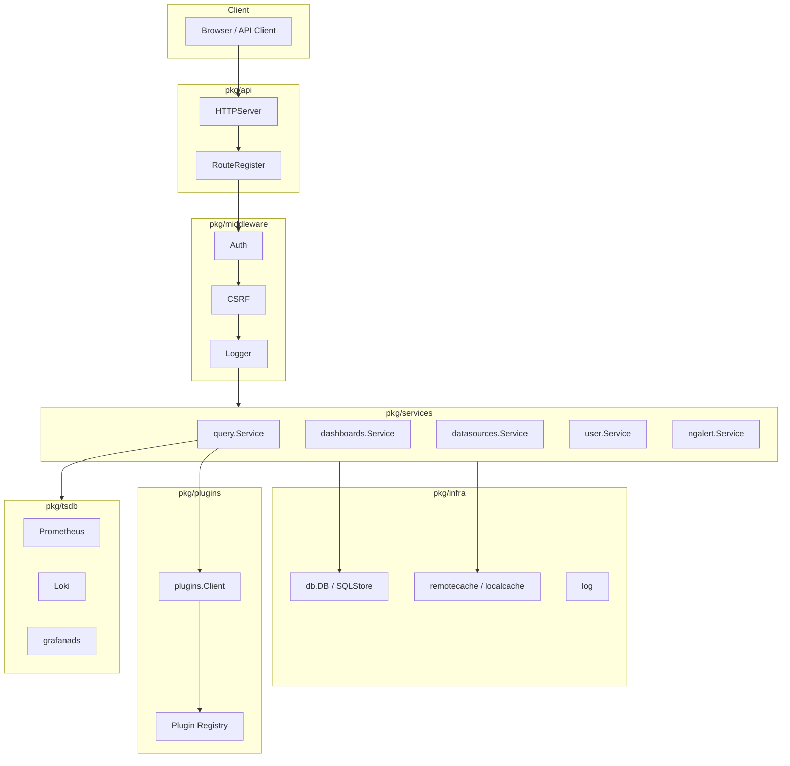
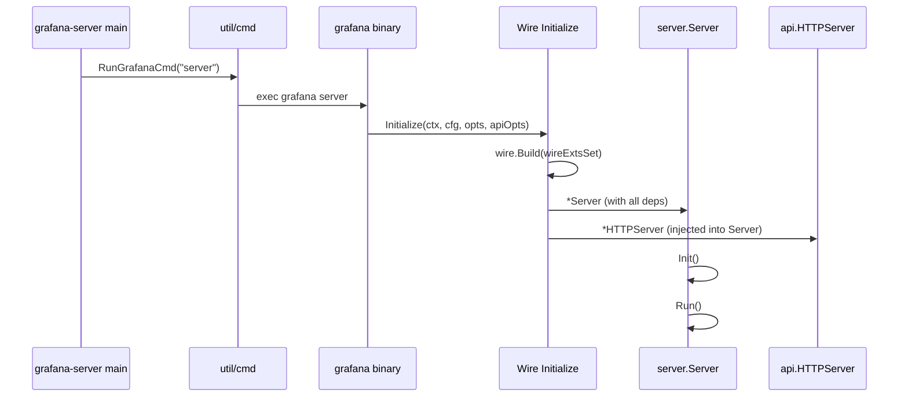
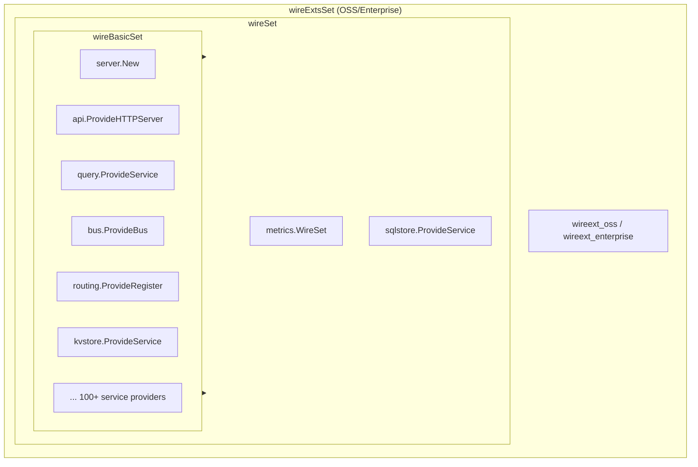
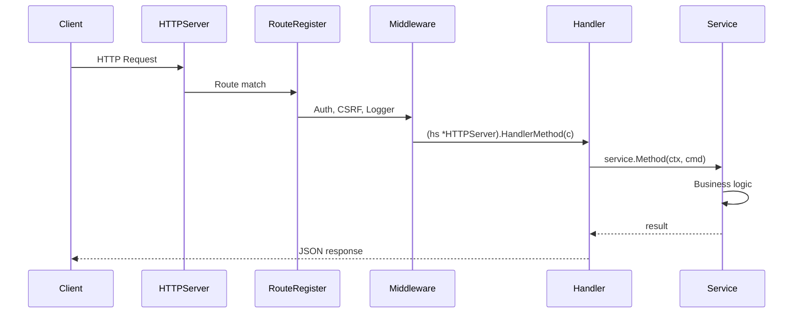
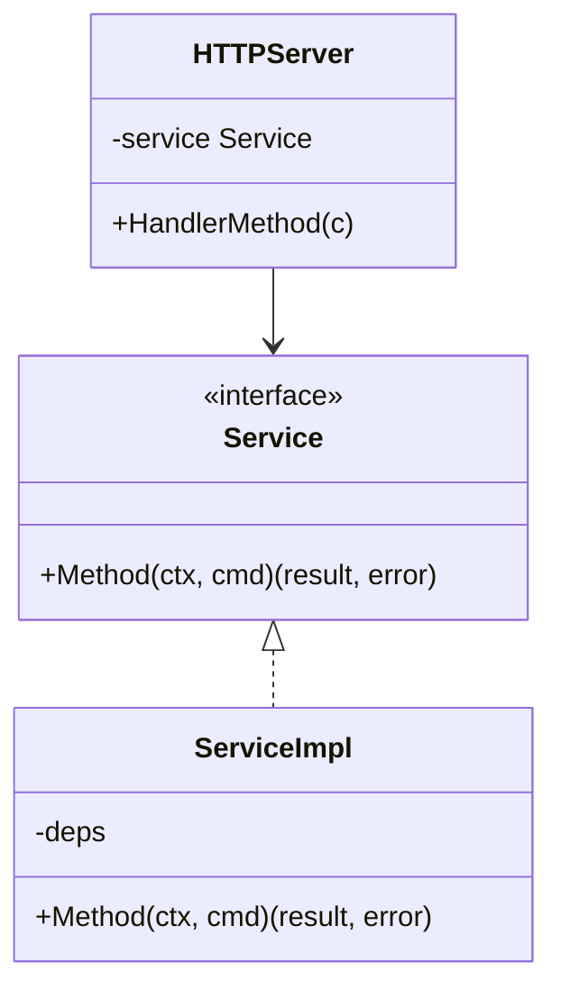
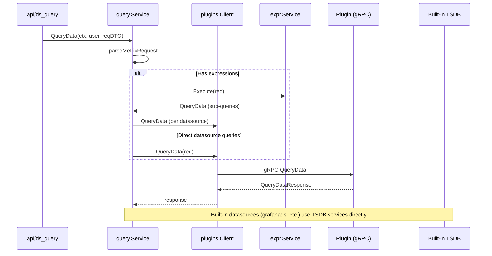
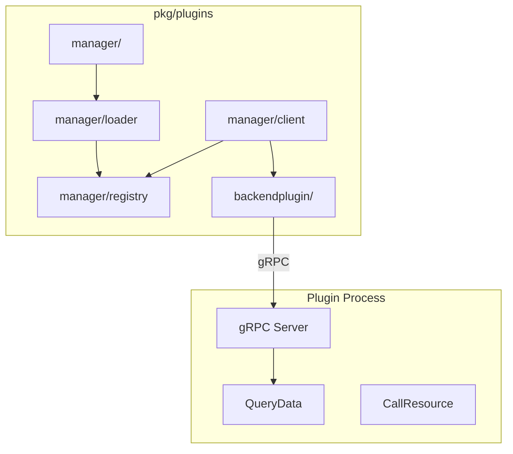
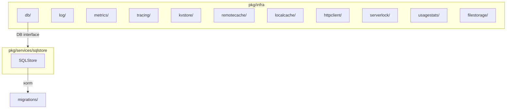
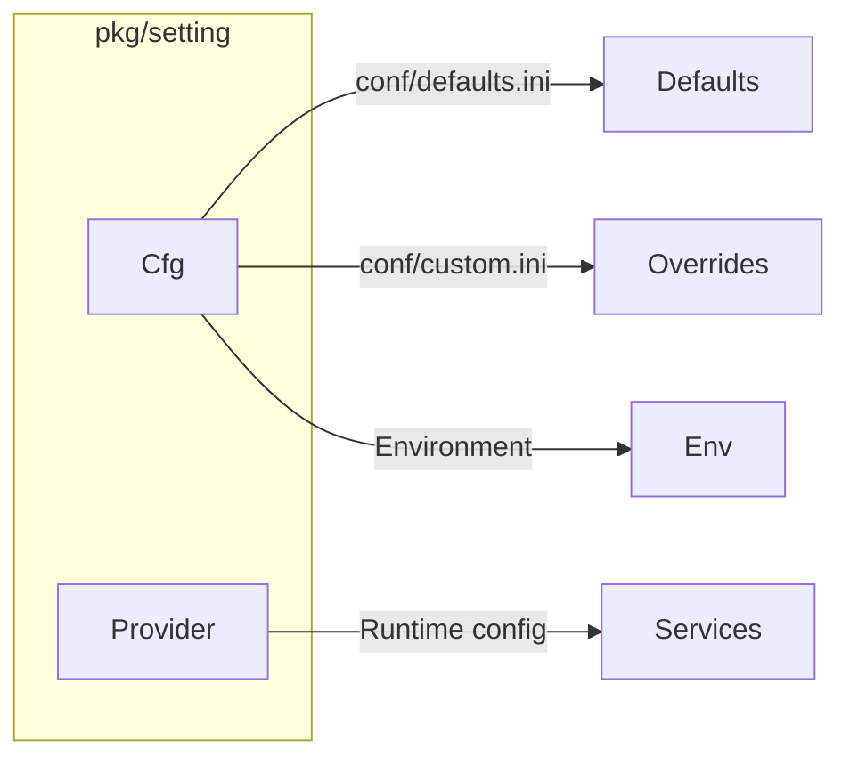

# Grafana Backend Core Architecture

This document describes the architecture of the Grafana backend core (`pkg/` directory), including directory layout, key components, data flow, Wire DI, and service interfaces. All content is derived from the actual codebase.

---

## Table of Contents

1. [Directory Layout](#directory-layout)
2. [High-Level Architecture](#high-level-architecture)
3. [Startup and Wire DI](#startup-and-wire-di)
4. [HTTP Request Flow](#http-request-flow)
5. [Service Layer](#service-layer)
6. [Query Execution Flow](#query-execution-flow)
7. [Plugin System](#plugin-system)
8. [Infrastructure Layer](#infrastructure-layer)
9. [Configuration](#configuration)

---

## Directory Layout

```mermaid
flowchart TB
    subgraph pkg["pkg/"]
        api["api/"]
        services["services/"]
        server["server/"]
        tsdb["tsdb/"]
        plugins["plugins/"]
        infra["infra/"]
        middleware["middleware/"]
        setting["setting/"]
        bus["bus/"]
        expr["expr/"]
        storage["storage/"]
        models["models/"]
        registry["registry/"]
        cmd["cmd/"]
    end

    api --> "HTTP handlers, routing, DTOs"
    services --> "Business logic by domain"
    server --> "Server init, Wire DI"
    tsdb --> "Built-in datasource backends"
    plugins --> "Plugin loader, gRPC client"
    infra --> "Logging, metrics, DB, cache"
    middleware --> "Auth, CSRF, logging"
    setting --> "Configuration management"
    bus --> "In-process event bus"
    expr --> "Expression evaluation"
    storage --> "Unified storage, secrets"
    registry --> "Background services, migrations"
    cmd --> "grafana-server, grafana-cli entrypoints"
```

### Top-Level `pkg/` Subdirectories

| Directory | Purpose |
|-----------|---------|
| `api/` | HTTP API handlers, routing, DTOs, response types |
| `services/` | Business logic by domain (50+ services) |
| `server/` | Server lifecycle, Wire DI setup (`wire.go`, `wire_gen.go`) |
| `tsdb/` | Built-in time series datasource backends (Prometheus, Loki, etc.) |
| `plugins/` | Plugin system: loader, registry, gRPC client, backend plugin interface |
| `infra/` | Infrastructure: logging, metrics, tracing, DB, cache, HTTP client |
| `middleware/` | HTTP middleware: auth, CSRF, logging, request metadata |
| `setting/` | Configuration (`Cfg`, `Provider`) from INI/env |
| `bus/` | In-process event bus for publish/subscribe |
| `expr/` | Expression evaluation (math, reduce, etc.) |
| `storage/` | Unified storage, legacy SQL, secret management |
| `registry/` | Background services, migrations, usage stats |
| `cmd/` | Entry points: `grafana-server`, `grafana-cli` |
| `models/` | Shared domain models |
| `util/` | Utilities (xorm, retryer, scheduler, etc.) |

---

## High-Level Architecture



---

## Startup and Wire DI

Grafana uses [Google Wire](https://github.com/google/wire) for dependency injection. The main Wire setup lives in `pkg/server/wire.go`.

### Startup Sequence



### Wire Structure



### Wire Bind Pattern

Services are typically bound from concrete implementations to interfaces:

```go
// Example from wire.go
wire.Bind(new(query.Service), new(*query.ServiceImpl)),
wire.Bind(new(bus.Bus), new(*bus.InProcBus)),
wire.Bind(new(db.DB), new(*sqlstore.SQLStore)),
wire.Bind(new(datasources.DataSourceService), new(*datasourceservice.Service)),
```

**Regenerate Wire**: Run `make gen-go` after changing service initialization.

---

## HTTP Request Flow



### API Layer (`pkg/api/`)

- **HTTPServer**: Central struct holding injected services (SearchService, FolderService, DataSourcesService, etc.) and route handlers.
- **RouteRegister**: Registers routes via `Get()`, `Post()`, `Put()`, `Delete()`, `Group()`.
- **Handlers**: Methods on `HTTPServer` (e.g. `Search`, `GetFolders`, `GetDataSourceByUID`) that delegate to services.

### Middleware (`pkg/middleware/`)

| Middleware | Purpose |
|------------|---------|
| `ReqSignedIn` | Require authenticated user |
| `ReqGrafanaAdmin` | Require Grafana admin |
| `ReqOrgAdmin` | Require org admin |
| `Auth()` | Generic auth with options |
| `authorize()` | Access control evaluator |
| `loggermw` | Request logging |
| `csrf` | CSRF protection |
| `requestmeta` | Request metadata (owner, etc.) |

---

## Service Layer

Services implement interfaces defined in the same package. Business logic lives in `pkg/services/<domain>/`, not in API handlers.

### Service Interface Pattern



### Key Services (subset)

| Service | Package | Purpose |
|---------|---------|---------|
| `query.Service` | `pkg/services/query` | Execute queries (plugins + expressions) |
| `dashboards.Service` | `pkg/services/dashboards` | Dashboard CRUD, provisioning |
| `datasources.DataSourceService` | `pkg/services/datasources` | Data source CRUD, cache |
| `folder.Service` | `pkg/services/folder` | Folder management |
| `user.Service` | `pkg/services/user` | User management |
| `ngalert` | `pkg/services/ngalert` | Alerting (rules, state, notifier) |
| `accesscontrol.AccessControl` | `pkg/services/accesscontrol` | RBAC |
| `authn.Service` | `pkg/services/authn` | Authentication |
| `secrets.Service` | `pkg/services/secrets` | Secret encryption/decryption |

### Bus (`pkg/bus`)

In-process event bus for decoupled communication:

```mermaid
flowchart LR
    Publisher["Service A"] -->|Publish(msg)| Bus["InProcBus"]
    Bus -->|AddEventListener(handler)| Listener1["Handler 1"]
    Bus -->|AddEventListener(handler)| Listener2["Handler 2"]
```

- `Publish(ctx, msg)` – dispatch by message type
- `AddEventListener(handler)` – register handler by message type

---

## Query Execution Flow



### Query Service (`pkg/services/query`)

- Parses `MetricRequest` into queries grouped by datasource UID.
- If expressions exist: delegates to `expr.Service`, which may issue sub-queries.
- Otherwise: delegates to `plugins.Client.QueryData()` for each datasource.
- Built-in datasources (e.g. `grafanads`) are registered as plugins and use the same path.

### Expression Service (`pkg/expr`)

- Evaluates expression queries (math, reduce, etc.).
- Issues sub-queries to underlying datasources via `query.Service`.

### TSDB Backends (`pkg/tsdb/`)

Built-in datasources each provide a `Service` via `ProvideService()`:

| Datasource | Package |
|------------|---------|
| Prometheus | `pkg/tsdb/prometheus` |
| Loki | `pkg/tsdb/loki` |
| Graphite | `pkg/tsdb/graphite` |
| Elasticsearch | `pkg/tsdb/elasticsearch` |
| CloudWatch | `pkg/tsdb/cloudwatch` |
| Azure Monitor | `pkg/tsdb/azuremonitor` |
| Cloud Monitoring | `pkg/tsdb/cloud-monitoring` |
| InfluxDB | `pkg/tsdb/influxdb` |
| Tempo | `pkg/tsdb/tempo` |
| Jaeger | `pkg/tsdb/jaeger` |
| Zipkin | `pkg/tsdb/zipkin` |
| MySQL | `pkg/tsdb/mysql` |
| PostgreSQL | `pkg/tsdb/grafana-postgresql-datasource` |
| MSSQL | `pkg/tsdb/mssql` |
| OpenTSDB | `pkg/tsdb/opentsdb` |
| grafanads | `pkg/tsdb/grafanads` |
| TestData | `pkg/tsdb/grafana-testdata-datasource` |
| Pyroscope | `pkg/tsdb/grafana-pyroscope-datasource` |
| Parca | `pkg/tsdb/parca` |

---

## Plugin System



### Key Interfaces

- **`plugins.Client`**: `QueryData`, `CallResource`, `CheckHealth`, etc. — delegates to plugin registry.
- **`plugins.Plugin`**: Represents a loaded plugin; implements `backend.QueryDataHandler`, `backend.CallResourceHandler`, etc.
- **`backendplugin.Plugin`**: gRPC client to the plugin process.

### Plugin Communication

- Plugins run as separate processes.
- Communication via gRPC (see `pkg/plugins/backendplugin/grpcplugin/`).
- Plugin SDK: `grafana-plugin-sdk-go/backend`.

---

## Infrastructure Layer



### Database

- **`db.DB`**: Interface in `pkg/infra/db`.
- **`sqlstore.SQLStore`**: Implements `db.DB`; uses xorm and sqlx.
- Migrations: `pkg/services/sqlstore/migrations/`. Run `make update-workspace` when adding modules.

### Caching

- **`remotecache.CacheStorage`**: Remote cache (Redis, etc.).
- **`localcache.CacheService`**: In-memory cache.

### Other Infra

- **`infra/log`**: Logging.
- **`infra/metrics`**: Prometheus metrics.
- **`infra/tracing`**: OpenTelemetry tracing.
- **`infra/httpclient`**: HTTP client provider (used by TSDB plugins).
- **`infra/serverlock`**: Distributed lock for server coordination.
- **`infra/kvstore`**: Key-value store.

---

## Configuration



- **`setting.Cfg`**: Main config struct; loaded from `conf/defaults.ini`, `conf/custom.ini`, and environment.
- **`setting.Provider`**: Runtime configuration provider.

---

## Summary of Diagrams

| Diagram | Type | Purpose |
|---------|------|---------|
| Directory Layout | Flowchart | Top-level `pkg/` structure and responsibilities |
| High-Level Architecture | Flowchart | Components and their relationships |
| Startup Sequence | Sequence | `main` → Wire → Server → API |
| Wire Structure | Flowchart | Wire sets and composition |
| HTTP Request Flow | Sequence | Request path through middleware and handlers |
| Service Interface Pattern | Class | Interface → implementation binding |
| Bus | Flowchart | In-process event bus usage |
| Query Execution Flow | Sequence | Query path from API to plugins/TSDB |
| Plugin System | Flowchart | Plugin manager, client, registry, gRPC |
| Infrastructure Layer | Flowchart | DB, cache, and infra packages |
| Configuration | Flowchart | Config loading and provision |

---

## Related Documentation

- [AGENTS.md](../../AGENTS.md) – Agent guidance for the repo
- [Documentation Style Guide](../AGENTS.md) – Docs authoring guidelines
- [Backend Apps Architecture](backend-apps.md) – Standalone Go apps and App SDK
- [Packages Architecture](packages-architecture.md) – Shared packages (`packages/`)
- `make gen-go` – Regenerate Wire after service changes
- `make gen-cue` – Regenerate CUE schemas after `kinds/` changes
