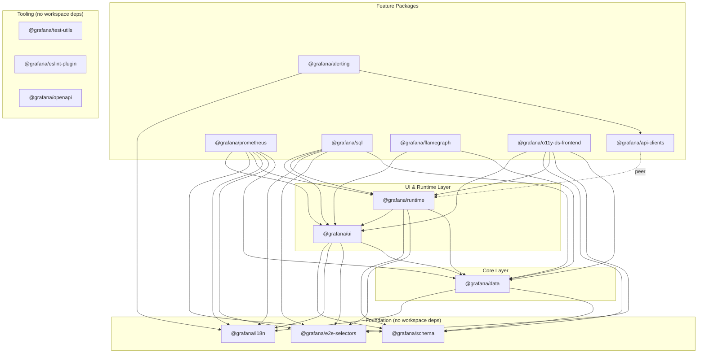
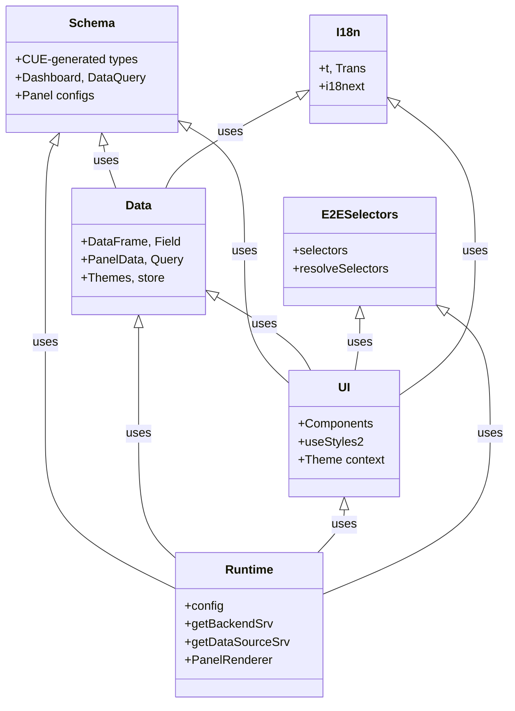
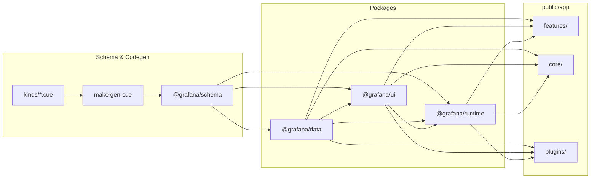
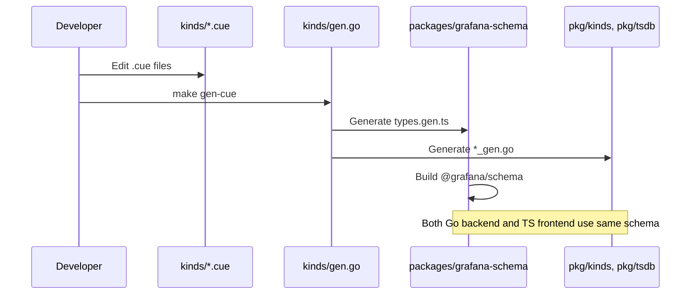
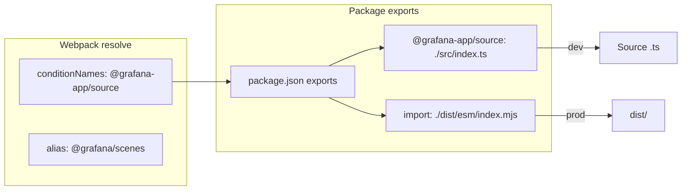
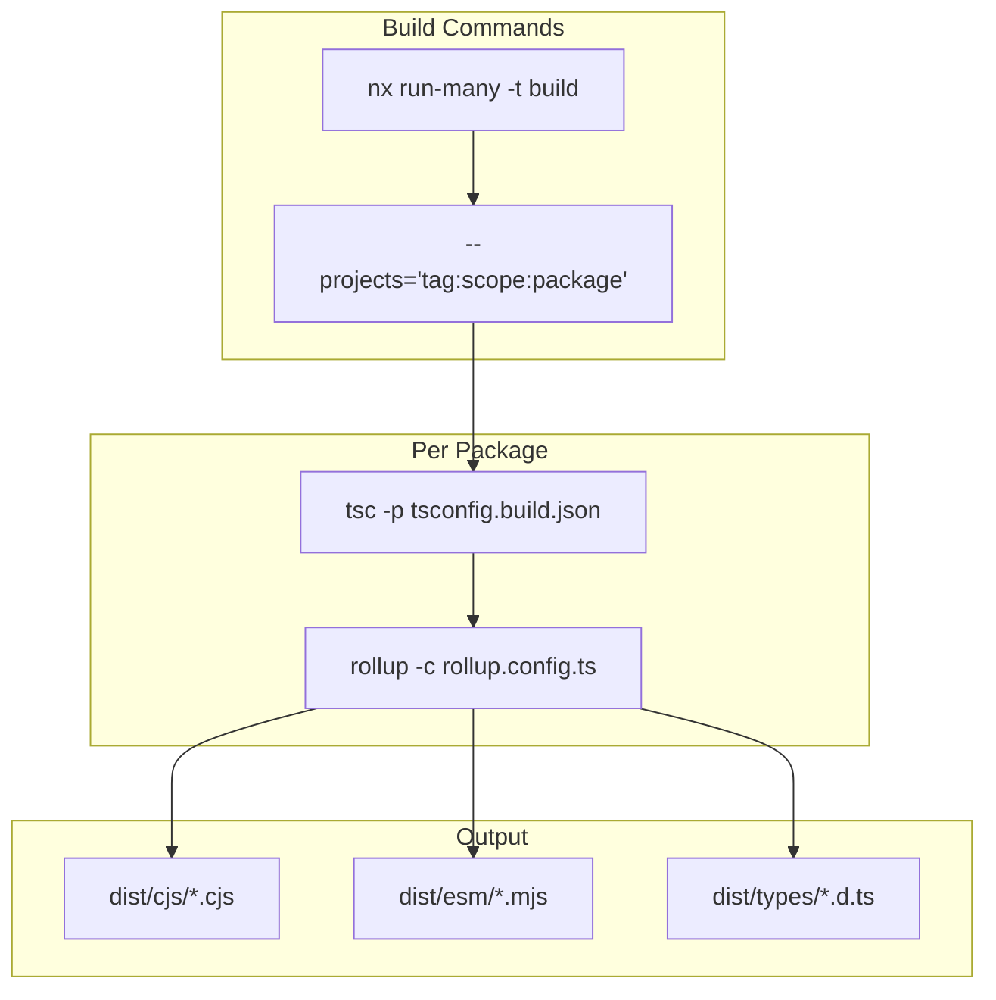

# Grafana Shared Packages Architecture

This document describes the architecture of the **Shared Packages** (`packages/`) directory in the Grafana repository — Yarn workspace packages that provide reusable data structures, UI components, runtime services, and tooling consumed by `public/app`, plugins, and other packages.

---

## Table of Contents

1. [Directory Layout](#directory-layout)
2. [Package Overview](#package-overview)
3. [Dependency Graph](#dependency-graph)
4. [Package Relationships](#package-relationships)
5. [Data Flow](#data-flow)
6. [Consumption by public/app](#consumption-by-publicapp)
7. [Versioning and Build](#versioning-and-build)
8. [Diagram Summary](#diagram-summary)

---

## Directory Layout

```
packages/
├── grafana-alerting/          # @grafana/alerting
├── grafana-api-clients/       # @grafana/api-clients
├── grafana-data/              # @grafana/data
├── grafana-e2e-selectors/     # @grafana/e2e-selectors
├── grafana-eslint-rules/      # @grafana/eslint-plugin
├── grafana-flamegraph/        # @grafana/flamegraph
├── grafana-i18n/              # @grafana/i18n
├── grafana-o11y-ds-frontend/  # @grafana/o11y-ds-frontend
├── grafana-openapi/           # @grafana/openapi
├── grafana-plugin-configs/    # @grafana/plugin-configs
├── grafana-prometheus/        # @grafana/prometheus
├── grafana-runtime/           # @grafana/runtime
├── grafana-schema/            # @grafana/schema
├── grafana-sql/               # @grafana/sql
├── grafana-test-utils/        # @grafana/test-utils
├── grafana-ui/                # @grafana/ui
├── README.md
└── rollup.config.parts.ts     # Shared Rollup config
```

**Note:** `@grafana/scenes` (dashboard framework) is an **external npm package** (version 6.57.0), not in `packages/`. It is consumed by `public/app` and by `@grafana/data` (dev) for tests. When linked locally, Webpack resolves it via `@grafana-app/source` or a symlink to the scenes repo.

---

## Package Overview

| Package | Role | Publishes | Key Exports |
|--------|------|-----------|-------------|
| **@grafana/data** | Data structures, types, utilities for time series, DataFrames, queries, themes | ✅ | `DataFrame`, `Field`, `PanelData`, `GrafanaTheme2`, `getBackendSrv`, `store` |
| **@grafana/ui** | React component library, design system | ✅ | `Button`, `Select`, `Modal`, `useStyles2`, `Icon` |
| **@grafana/runtime** | Runtime services, config, plugin APIs | ✅ | `config`, `getBackendSrv`, `getDataSourceSrv`, `PanelRenderer`, `featureEnabled` |
| **@grafana/schema** | CUE-generated TypeScript types for dashboards, panels, datasources | ✅ | `Dashboard`, `DataQuery`, panel/datasource config types |
| **@grafana/e2e-selectors** | E2E test selectors (data-testid) | ✅ | `selectors`, `resolveSelectors` |
| **@grafana/i18n** | Internationalization (i18next, Trans, t) | ✅ | `t`, `Trans`, `i18n` |
| **@grafana/alerting** | Alerting library for vertical integrations | ✅ | Alerting APIs, rule types |
| **@grafana/api-clients** | RTK Query API clients (generated from OpenAPI) | ❌ private | `rtkq/*` endpoints |
| **@grafana/prometheus** | Prometheus/PromQL query editor, components | ✅ | PromQL editor, query builder |
| **@grafana/sql** | SQL query editor, shared SQL UI | ❌ private | SQL editor components |
| **@grafana/flamegraph** | Flamegraph visualization | ✅ | Flamegraph component |
| **@grafana/o11y-ds-frontend** | Observability datasource frontend (traces, etc.) | ❌ private | Trace management |
| **@grafana/openapi** | OpenAPI specs for API client generation | ✅ | `api/*`, `apis/*` JSON |
| **@grafana/test-utils** | MSW handlers, test helpers, mocks | ❌ private | `setupMockServer`, `handlers` |
| **@grafana/eslint-plugin** | Custom ESLint rules | ❌ private | `@grafana/eslint-plugin` |
| **@grafana/plugin-configs** | Shared webpack/config for plugins | ❌ private | Build config |

---

## Dependency Graph

The following diagram shows workspace package dependencies (excluding external npm deps). Arrows point from consumer → dependency.



---

## Package Relationships



---

## Data Flow



### CUE → Schema Flow



---

## Consumption by public/app

The main Grafana app (`public/app`) consumes packages via `workspace:*` in root `package.json`. Webpack resolves them with the `@grafana-app/source` condition, which prefers source over built output for faster dev builds.

### Import Patterns

| Package | Typical Import | Usage |
|---------|----------------|-------|
| @grafana/data | `import { DataFrame, GrafanaTheme2 } from '@grafana/data'` | Data types, Redux store, theme |
| @grafana/ui | `import { Button, useStyles2 } from '@grafana/ui'` | Components, styling |
| @grafana/runtime | `import { config, getBackendSrv } from '@grafana/runtime'` | Config, HTTP, datasources |
| @grafana/schema | `import { Dashboard } from '@grafana/schema'` | Dashboard/panel types |
| @grafana/i18n | `import { t, Trans } from '@grafana/i18n'` | Translations |
| @grafana/e2e-selectors | `import { selectors } from '@grafana/e2e-selectors'` | E2E test IDs |
| @grafana/scenes | `import { SceneGridLayout, VizPanel } from '@grafana/scenes'` | Dashboard scene objects |
| @grafana/test-utils | `import { setupMockServer } from '@grafana/test-utils/server'` | Tests only |

### Webpack Resolution



---

## Versioning and Build

### Versioning

- All packages use the same version as Grafana (e.g. `13.0.0-pre`).
- Lerna manages versions: `yarn packages:prepare`.
- Prereleases: `<version>-<DRONE_BUILD_NUMBER>`.
- See [packages/README.md](../packages/README.md) for release steps.

### Build Pipeline



### Build Order (Nx)

Packages are built via Nx with `tag:scope:package`. Nx infers order from dependencies. Typical order:

1. `@grafana/schema`, `@grafana/e2e-selectors`, `@grafana/i18n`
2. `@grafana/data`
3. `@grafana/ui`, `@grafana/runtime`
4. `@grafana/alerting`, `@grafana/prometheus`, `@grafana/flamegraph`, etc.

### Key Scripts

| Script | Purpose |
|--------|---------|
| `yarn packages:build` | Build all packages |
| `yarn packages:typecheck` | TypeScript check all packages |
| `yarn packages:clean` | Remove dist/ and npm-artifacts |
| `yarn packages:pack` | Create .tgz for publishing |
| `make gen-cue` | Regenerate CUE → schema/types |

---

## Diagram Summary

| Diagram | Purpose |
|---------|---------|
| **Dependency Graph** | Shows which packages depend on which; foundation → core → UI/runtime → feature layers |
| **Package Relationships** | Class-style view of schema, data, ui, runtime, e2e, i18n and how they relate |
| **Data Flow** | CUE → schema → packages → public/app; schema as single source of truth |
| **CUE → Schema Flow** | Sequence of `make gen-cue` producing TS and Go from CUE |
| **Webpack Resolution** | How `@grafana-app/source` resolves to source in dev vs dist in prod |
| **Build Pipeline** | Nx + tsc + rollup producing CJS, ESM, and types |

---

## Related Documentation

- [packages/README.md](../../packages/README.md) — Export conventions, versioning, local dev
- [AGENTS.md](../../AGENTS.md) — Project overview and commands
- [kinds/](../../kinds/) — CUE schema definitions
- [docs/AGENTS.md](../AGENTS.md) — Documentation style guide
