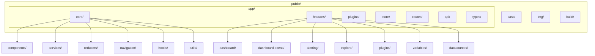
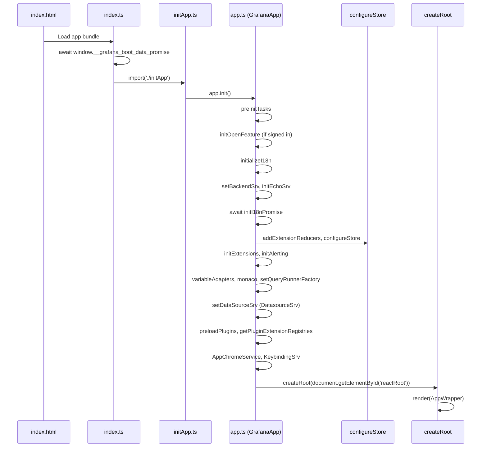
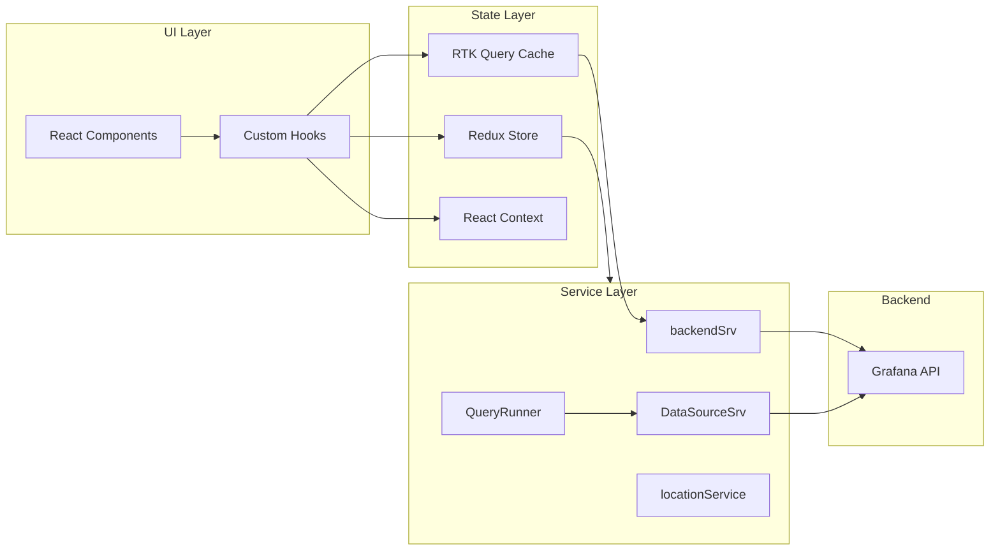
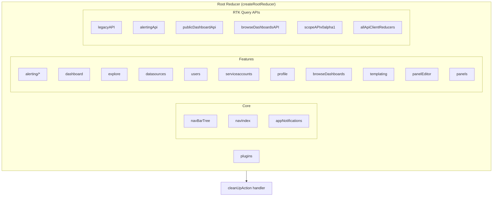
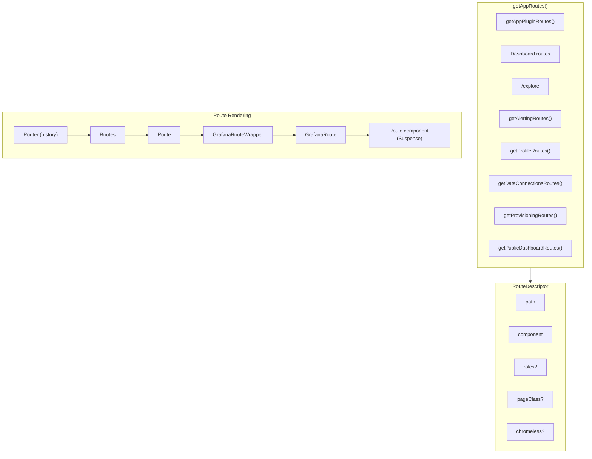
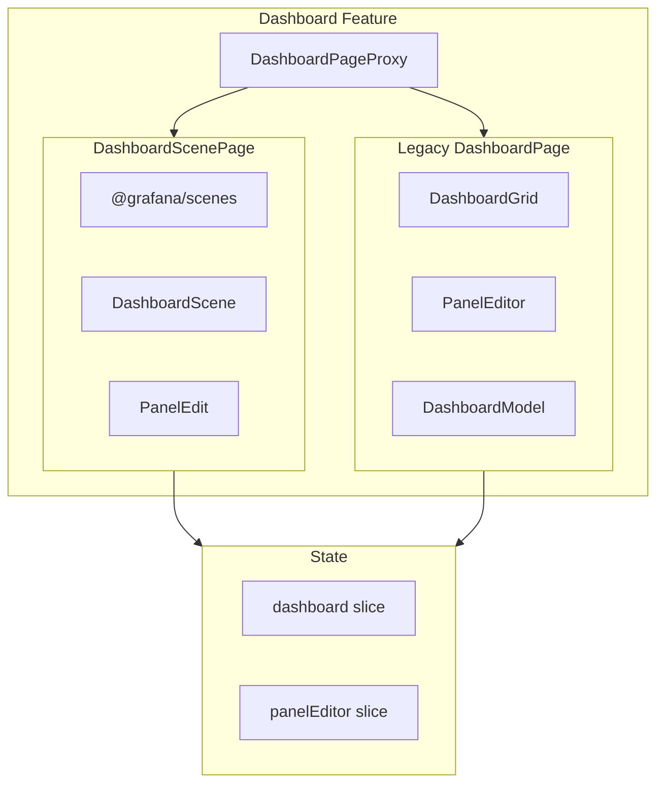
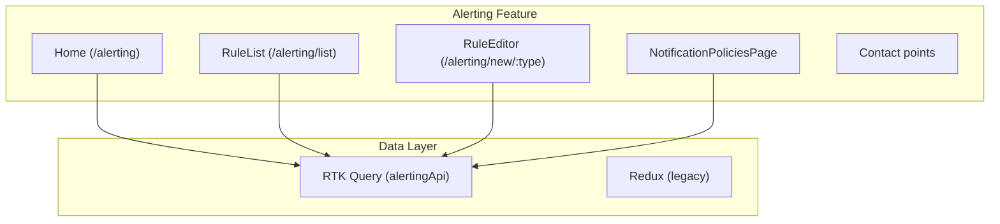
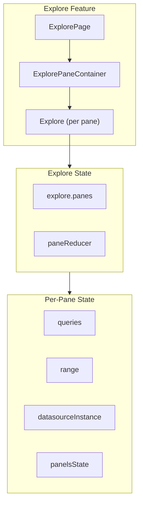
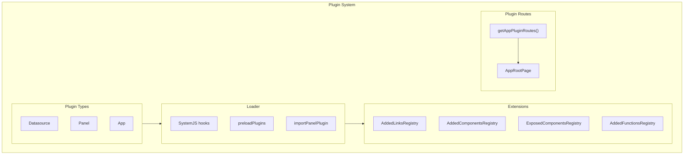

# Grafana Frontend App Architecture

This document describes the architecture of the Grafana frontend application in the `public/` directory. It covers the React/TypeScript structure, core components, features, plugin system, state management, and routing.

---

## 1. Overview

The Grafana frontend is a React/TypeScript SPA built with:

- **React 18** with function components and hooks
- **Redux Toolkit** for state management (slices, thunks, RTK Query)
- **React Router v6** (via `react-router-dom-v5-compat`)
- **Emotion** for CSS-in-JS via `useStyles2`
- **Webpack** for bundling (scripts in `scripts/webpack/`)

The app bootstraps asynchronously: `index.html` loads `window.grafanaBootData`, then the app bundle initializes via `initApp.ts` → `app.ts`.

---

## 2. Directory Layout



### Top-Level Directories

| Directory | Purpose |
|-----------|---------|
| `public/app/core/` | Shared services, components, reducers, navigation, hooks |
| `public/app/features/` | Feature code by domain (dashboard, alerting, explore, etc.) |
| `public/app/plugins/` | Built-in datasource and panel plugins, loader, extensions |
| `public/app/store/` | Redux store configuration and instance |
| `public/app/routes/` | Route definitions and wrapper components |
| `public/app/api/` | RTK Query API clients (generated and custom) |
| `public/app/types/` | TypeScript type definitions |
| `public/sass/` | Legacy SASS styles |
| `public/img/` | Static images |
| `public/build/` | Webpack output |

### Core Structure (`public/app/core/`)

| Subdirectory | Purpose |
|--------------|---------|
| `components/` | AppChrome, Login, Page, Breadcrumbs, Select, OptionsUI, FormPrompt, DynamicImports |
| `services/` | backend_srv, context_srv, echo, PreferencesService, KeybindingSrv |
| `reducers/` | navBarTree, navIndex, appNotifications |
| `navigation/` | GrafanaRoute, RouteDescriptor types |
| `hooks/` | useBusEvent, useNavModel, useCleanup |
| `utils/` | fetch, browser, timePicker, richHistory, ConfigProvider |
| `context/` | ModalsContextProvider, GrafanaContext |
| `internationalization/` | loadTranslations, dates |

---

## 3. Component Hierarchy

```mermaid
flowchart TB
    subgraph Bootstrap["Bootstrap"]
        index["index.ts"]
        initApp["initApp.ts"]
        app["app.ts (GrafanaApp)"]
    end

    index --> initApp
    initApp --> app

    subgraph AppWrapper["AppWrapper"]
        Provider["Provider (Redux)"]
        ErrorBoundary["ErrorBoundaryAlert"]
        OpenFeature["OpenFeatureProvider"]
        GrafanaContext["GrafanaContext.Provider"]
        ThemeProvider["ThemeProvider"]
        CacheProvider["CacheProvider"]
        KBarProvider["KBarProvider"]
        ScopesContext["ScopesContextProvider"]
        ExtensionRegistries["ExtensionRegistriesProvider"]
        ExtensionSidebar["ExtensionSidebarContextProvider"]
        RouterWrapper["RouterWrapper"]
    end

    app --> Provider
    Provider --> ErrorBoundary
    ErrorBoundary --> OpenFeature
    OpenFeature --> GrafanaContext
    GrafanaContext --> ThemeProvider
    ThemeProvider --> CacheProvider
    CacheProvider --> KBarProvider
    KBarProvider --> ScopesContext
    ScopesContext --> ExtensionRegistries
    ExtensionRegistries --> ExtensionSidebar
    ExtensionSidebar --> RouterWrapper

    subgraph RouterWrapper["RouterWrapper"]
        Router["Router (react-router)"]
        CompatRouter["CompatRouter"]
        QueriesDrawer["QueriesDrawerContextProvider"]
        ModalsContext["ModalsContextProvider"]
        AppChrome["AppChrome"]
        Routes["Routes"]
    end

    Router --> CompatRouter
    CompatRouter --> QueriesDrawer
    QueriesDrawer --> ModalsContext
    ModalsContext --> AppChrome
    AppChrome --> Routes

    subgraph RouteRendering["Route Rendering"]
        GrafanaRouteWrapper["GrafanaRouteWrapper"]
        GrafanaRoute["GrafanaRoute"]
        RouteComponent["Route Component (lazy)"]
    end

    Routes --> GrafanaRouteWrapper
    GrafanaRouteWrapper --> GrafanaRoute
    GrafanaRoute --> RouteComponent
```



---

## 4. App Bootstrap Flow



---

## 5. Data Flow



### Data Flow Patterns

- **Redux**: `useSelector`, `useDispatch` for global UI state (nav, explore panes, dashboard init, variables)
- **RTK Query**: `useGetXQuery`, `useXMutation` for server data (alerting, browse-dashboards, public dashboards, scope API)
- **Context**: GrafanaContext (backend, location, chrome, config), ModalsContext, QueriesDrawerContext, ScopesContext
- **Services**: Injected via `@grafana/runtime` (setBackendSrv, setDataSourceSrv, setLocationSrv)

---

## 6. Redux Store Structure



### Store Configuration (`store/configureStore.ts`)

- **Middleware**: thunk, listenerMiddleware, alertingApi, publicDashboardApi, browseDashboardsAPI, legacyAPI, scopeAPIv0alpha1, allApiClientMiddleware
- **Preloaded state**: `navIndex` from `buildInitialState()`
- **RTK Query**: `setupListeners(store.dispatch)` for refetchOnFocus/refetchOnReconnect

### Key Reducer Slice Locations

| Slice | Purpose |
|-------|---------|
| `core/reducers/navModel.ts` | Navigation index |
| `core/reducers/navBarTree.ts` | Nav bar tree |
| `features/dashboard/state/reducers.ts` | Dashboard init, model |
| `features/explore/state/main.ts` | Explore panes, split |
| `features/explore/state/explorePane.ts` | Per-pane state |
| `features/alerting/state/reducers.ts` | Alert rules, channels |
| `features/variables/state/keyedVariablesReducer.ts` | Template variables |
| `features/browse-dashboards/state/slice.ts` | Browse dashboards |

---

## 7. Routing



### Route Types

| Path Pattern | Component | Purpose |
|-------------|-----------|---------|
| `/` | DashboardPageProxy | Home dashboard |
| `/d/:uid/:slug?` | DashboardPageProxy | Dashboard by UID |
| `/dashboard/new` | DashboardPageProxy | New dashboard |
| `/explore` | ExplorePage | Explore |
| `/alerting/*` | Various | Alerting (Home, RuleList, etc.) |
| `/dashboards` | BrowseDashboardsPage | Dashboard list |
| `/a/:pluginId/*` | AppRootPage | App plugin pages |
| `/datasources/*` | Various | Data connections |

### Route Wrapper Flow

1. `GrafanaRouteWrapper` checks `allowAnonymous`, `roles`, and redirects if needed.
2. `GrafanaRoute` sets chrome, keybindings, body classes, and renders the route component inside `Suspense`.
3. Route components are lazy-loaded via `SafeDynamicImport`.

---

## 8. Key Features

### 8.1 Dashboard



- **DashboardPageProxy** chooses between `DashboardScenePage` (Scenes) and legacy `DashboardPage` based on `isDashboardSceneEnabled()`.
- **DashboardScenePage**: Uses `@grafana/scenes` (DashboardScene, SceneGrid, etc.).
- **Legacy**: DashboardModel, DashboardGrid, PanelEditor, initDashboard thunks.

### 8.2 Alerting



- **Primary data**: RTK Query (`alertingApi`, `alertRuleApi`, etc.) from `@grafana/api-clients` and custom enhancements.
- **Legacy**: Redux reducers in `state/reducers.ts` and `unified/reducers/`.

### 8.3 Explore



- **ExplorePage**: Syncs URL via `useStateSync`, manages split panes via Redux.
- **State**: `explore.panes` keyed by `exploreId`; each pane has queries, range, datasource, panelsState.

---

## 9. Plugin Architecture



### Plugin Types

| Type | Location | Purpose |
|------|----------|---------|
| **Datasource** | `plugins/datasource/` | Prometheus, Loki, Tempo, Elasticsearch, etc. |
| **Panel** | `plugins/panel/` | timeseries, table, stat, geomap, etc. |
| **App** | External (loaded via nav) | Rendered at `/a/:pluginId/*` | 

### Extension Points

- **Added Links**: Registry for plugin links (e.g. dashboard links).
- **Added Components**: Registry for plugin-provided components.
- **Exposed Components**: Core components exposed to plugins (e.g. AddToDashboardForm, CreateAlertFromPanel).
- **Added Functions**: Registry for plugin-provided functions.

Hooks: `setPluginLinksHook`, `setPluginComponentHook`, `setPluginComponentsHook`, `setPluginFunctionsHook`.

### Built-in Datasource Plugins

Examples: `prometheus`, `loki`, `tempo`, `jaeger`, `elasticsearch`, `influxdb`, `cloudwatch`, `azuremonitor`, `grafana`, `grafana-testdata-datasource`, `grafana-postgresql-datasource`, `grafana-pyroscope-datasource`, `mixed`, `dashboard`, `alertmanager`, `graphite`, `opentsdb`, `mssql`, `mysql`, `parca`, `zipkin`.

### Built-in Panel Plugins

Examples: `timeseries`, `table`, `stat`, `gauge`, `bargauge`, `piechart`, `heatmap`, `geomap`, `logs`, `logstable`, `nodeGraph`, `flamegraph`, `traces`, `canvas`, `alertlist`, `annolist`, `datagrid`, `xychart`, `candlestick`, `trend`, `barchart`, `histogram`, `state-timeline`, `status-history`, `dashlist`, `text`, `welcome`, `gettingstarted`, `news`, `live`, `debug`.

---

## 10. Shared Patterns

### 10.1 Styling (Emotion)

```typescript
import { useStyles2 } from '@grafana/ui';

const getStyles = (theme: GrafanaTheme2) => ({
  wrapper: css`
    padding: ${theme.spacing(2)};
    background: ${theme.colors.background.primary};
  `,
});

function MyComponent() {
  const styles = useStyles2(getStyles);
  return <div className={styles.wrapper}>...</div>;
}
```

- **Pattern**: `useStyles2(getStyles)` with theme-aware `css` from `@emotion/css`.
- **Location**: `@grafana/ui` re-exports `useStyles2`, `useTheme2`.

### 10.2 RTK Query

```typescript
import { useGetAlertRulesQuery } from '../api/alertRuleApi';

function Component() {
  const { data, isLoading, error } = useGetAlertRulesQuery(params);
  // ...
}
```

- **API slices**: `alertingApi`, `publicDashboardApi`, `browseDashboardsAPI`, `legacyAPI`, `scopeAPIv0alpha1`, `@grafana/api-clients/rtkq`.
- **Base query**: Custom `backendSrvBaseQuery` for alerting; generated clients for others.

### 10.3 Custom Hooks

| Hook | Purpose |
|------|---------|
| `useGrafana()` | GrafanaContext (backend, location, chrome, config) |
| `useNavModel(id)` | Nav model for section |
| `useSelector`, `useDispatch` | Redux (from `app/types/store`) |
| `useStyles2(getStyles)` | Emotion styles |
| `useTheme2()` | Theme |

### 10.4 Lazy Loading

- **SafeDynamicImport**: Wraps `import()` for dynamic route loading.
- **Webpack chunks**: Named via `/* webpackChunkName: "..." */` in comments.

---

## 11. Build Configuration

- **Build**: `yarn build` → `scripts/webpack/webpack.prod.js`
- **Dev**: `yarn start` → `scripts/webpack/webpack.dev.js` (watch mode)
- **Tooling**: Nx for task orchestration; Webpack for bundling.
- **Plugin builds**: Some datasource plugins have their own `webpack.config.ts` (e.g. Loki, Tempo, Elasticsearch).

---

## 12. Summary of Diagrams

| Diagram | Purpose |
|---------|---------|
| **Directory Layout** | Top-level structure of `public/` and `app/` |
| **Component Hierarchy** | Bootstrap → AppWrapper → RouterWrapper → Route rendering |
| **App Bootstrap Flow** | Sequence of initialization steps from index.html to render |
| **Data Flow** | UI → State (Redux, RTK Query, Context) → Services → Backend |
| **Redux Store Structure** | Root reducer composition (core, features, RTK Query APIs) |
| **Routing** | Route definitions, RouteDescriptor, and rendering flow |
| **Dashboard Feature** | DashboardPageProxy, Scenes vs Legacy, state slices |
| **Alerting Feature** | Route components and data layer (RTK Query vs Redux) |
| **Explore Feature** | ExplorePage, panes, per-pane state |
| **Plugin Architecture** | Plugin types, loader, extensions, routes |

---

*Last updated: Derived from codebase in `public/app/`.*
